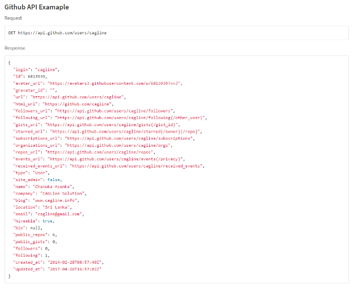

# HATEOAS Driven REST APIs

* HATEOAS (**Hypermedia as the Engine of Application State**) is a constraint of the REST application architecture that keeps the RESTful style architecture unique from most other network application architectures. 

* The term **“Hypermedia”** refers to any content that contains links to other forms of media such as images, movies, and text.

* A resource’s state representation **includes links to related resources**. It allows the client can dynamically navigate to the appropriate resources by traversing the hypermedia links.

For example, below given JSON response may be from an API like HTTP GET 
``` javascript
http://api.domain.com/management/departments/10
```
``` javascript
{
    "departmentId": 10,
    "departmentName": "Administration",
    "locationId": 1700,
    "managerId": 200,
    "links": [
        {
            "href": "10/employees",
            "rel": "employees",
            "type" : "GET"
        }
    ]
}
```

<!-- In the preceding example, the response returned by the server contains hypermedia links to employee resources 10/employees, which can be traversed by the client to read employees belonging to the department. -->

* The advantage of the above approach is that hypermedia links returned from the server drive the application’s state and not the other way around.

<!-- There is no universally accepted format for representing links between two resources in JSON.  -->

* You may choose to adopt the above format, or you may decide to send links in HTTP response headers.

``` javascript
HTTP/1.1 200 OK
...
Link: <10/employees>; rel="employees"

```

> This is not practical when we develop api’s that’s why famous api’s like facebook, google also not use HATEOAS much.

> But github is embrace this HATEOAS feature very well,




<!--  -->

<!-- Both are absolutely valid solutions. -->

<!-- HATEOAS Implementation
In the real world, when you visit a website – you hit its homepage. It presents some snapshots and links to other sections of websites. You click on them, and then you get more information along with more related links that are relevant to the context.

Similar to a human’s interaction with a website, a REST client hits an initial API URI and uses the server-provided links to dynamically discover available actions and access the resources it needs. The client need not have prior knowledge of the service or the different steps involved in a workflow. Additionally, the clients no longer have to hard code the URI structures for various resources. HATEOAS allows the server to make URI changes as the API evolves without breaking the clients.

Above API interaction is possible using HATEOAS only.

Each REST framework provides it’s own way on creating the HATEOAS links using framework capabilities e.g. in this RESTEasy HATEOAS tutorial, links are part of resource model classes which is transferred as resource state to the client.

HATEOAS References
The following are the two popular formats for specifying JSON REST API hypermedia links:

RFC 5988 (web linking)
RFC 5988 puts forward a framework for building links that defines the relation between resources on the web. Each link in RFC 5988 contains the following properties:

Target URI: Each link should contain a target Internationalized Resource Identifiers (IRIs). This is represented by the href attribute.

Link relation type: The link relation type describes how the current context (source) is related to the target resource. This is represented by the rel attribute.

Attributes for target IRI: The attributes for a link include hreflang, media, title, and type, and any extension link parameters.

JSON Hypermedia API Language (HAL)
JSON HAL is a promising proposal that sets the conventions for expressing hypermedia controls, such as links, with JSON or XML. It is in the draft stage at this time.

The two associated MIME types are

media type: application/hal+xml 
media type: application/hal+json
Each link in HAL may contain the following properties:

Target URI: It indicates the target resource URI. This is represented by the href attribute.
Link relation: The link relation type describes how the current context is related to the target resource. This is represented by the rel attribute.
Type: This indicates the expected resource media type. This is represented by the type attribute.

There is no right or wrong in choosing a hypermedia link format for your application. You should pick up a format that meets most of your use case requirements and stick to it. -->