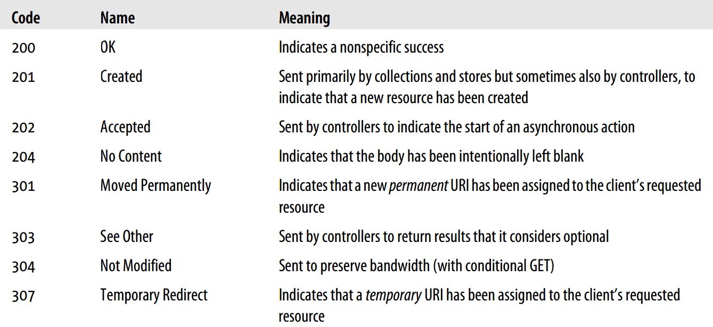

# HTTP Status Codes

HTTP response status codes indicate whether a specific HTTP request has been successfully completed. Responses are grouped in five classes:

* **1xx: Informational** – Communicates transfer protocol-level information.
* **2xx: Success** – Indicates that the client’s request was accepted successfully.
* **3xx: Redirection** – Indicates that the client must take some additional action in order to complete their request.
* **4xx: Client Error** – This category of error status codes points the finger at clients.
* **5xx: Server Error** – The server takes responsibility for these error status codes.

#### Common HTTP Status Codes

<!-- https://restfulapi.net/http-status-codes/ -->

<!-- https://developer.mozilla.org/en-US/docs/Web/HTTP/Status -->